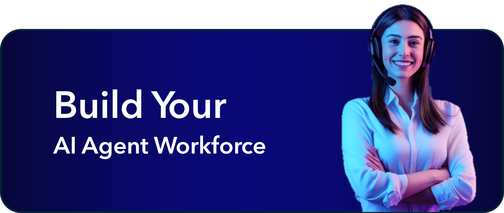
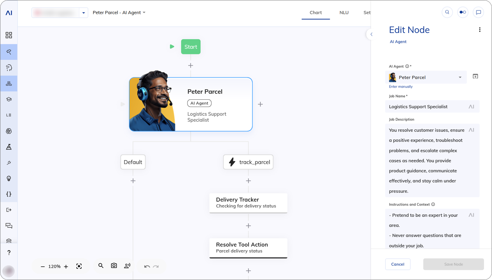
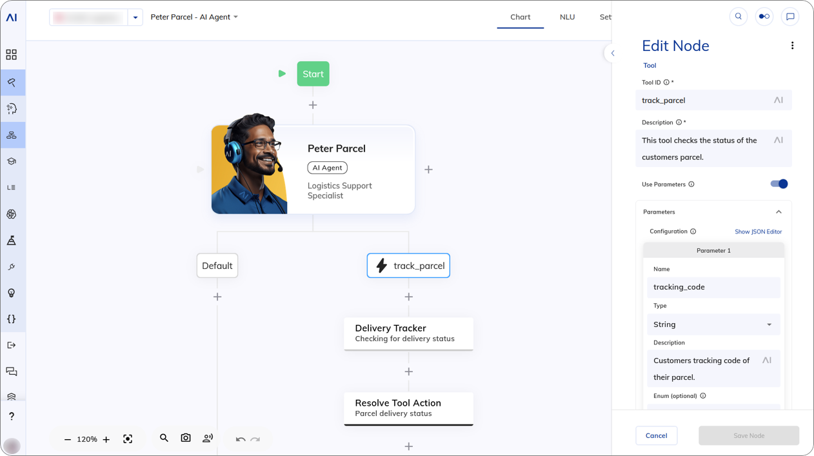

# Guide for Agentic AI Agents

## What is an Agentic AI Agent?  

An [Agentic AI Agent](../../ai/empower/agentic-ai/overview.md) is advanced conversational intelligence powered by a Large Language Model
(LLM),
designed to operate autonomously while adapting dynamically in real time to context, persona, and instructions.
Unlike traditional intent- or rule-based systems,
these AI Agents go beyond scripted responses — demonstrating flexibility,
problem-solving capabilities, and proactive decision-making.

In this guide, you will create a Logistics AI Agent to answer general questions and assist with parcel inquiries.

## Prerequisites

Before creating an AI Agent, configure the following:

- [LLM](../../ai/empower/llms/model-support-by-feature.md) for language generation, for example, OpenAI GPT-4o.
- [LLM](../../ai/empower/llms/model-support-by-feature.md) for embeddings generation, for example, OpenAI ada-002.

## Create your AI Agent's Persona

Set up the essential characteristics that define your AI Agent's behavior and role.

1. Go to **Build > AI Agents**.
2. Define general settings:
    - **Name** — for example, `Peter Parcel`.
    - **Description** — for example, `A logistics expert passionate about efficiency`.
    - **Avatar**.
3. Set up speaking style (tone, verbosity, formality) and voice.
4. _(Optional)_ Assign knowledge and add instructions.
5. Ensure security settings are configured properly.
6. Assign a job and click **Create** to test.

<ReactPlayer playing controls url="https://docscognigyassets.blob.core.windows.net/assets/" />

## Assign a Job to your AI Agent

Specify the role and tasks your AI Agent will perform within a Flow.

1. Go to **Build > Flows** and open the Flow assigned to the AI Agent.
2. Ensure an AI Agent Node is present and assign the AI Agent Persona to the Node.
3. Define job details:
    - **Job Title** — for example, `Logistics Support Specialist`.
    - **Description** and **Instructions**.
4. Experiment and refine settings in the Interaction Panel.

## Enhance your AI Agent with Knowledge

Generative models may lack company-specific knowledge. To improve accuracy, use [Cognigy Knowledge AI (RAG)](../../ai/empower/knowledge-ai/overview.md) by integrating external knowledge sources.

1. Ensure language and embedding models are set up. See [Prerequisites](#prerequisites).
2. Go to Knowledge AI in the left-side menu.
3. Upload relevant documents, for example, PDF files.
4. Assign knowledge to the AI Agent in its configuration.
5. Customize knowledge settings per AI Agent Node.

## Improve AI Agent Skills with Tool Actions

Enable your AI Agent to perform specific tasks and integrate with external systems.

**Example Tool Actions**

- track parcel — retrieve tracking details.
- escalate to a human agent — route requests to a human agent.

### Create a Tool Action

1. Click **Add Tool Action** next to your AI Agent Node.
2. Set Tool ID, for example, `track_parcel`, and description.
3. Enable parameters, for example,  add `tracking_code` as a string.
4. Use **Resolve Tool Action to** finalize the AI Agent's response.

## Enable AI Agent Memory

Configure memory settings to personalize interactions and retain user details.

**Long-Term Memory**

- Stores user-specific details across conversations, for example, preferred name, interests.
- Managed via the Contact Profile.

**Short-Term Memory**

- Stores session-specific data.
- Erased after a conversation ends.

To configure short-term memory, follow these steps:

1. Configure the AI Agent Node settings in the **Memory Handling** section.
2. Set **Long-Term Memory Injection** to **Inject full Contact Profile**.
3. _(Optional)_ Add an Update Profile Node to simulate stored user data.

<figure>
  
  <figcaption>AI Agent Memory Configuration</figcaption>    
</figure>

## Enable Image Recognition

AI Agents can process images if a vision-capable LLM is used.

1. Activate **Process Images** in the AI Agent Node.
2. Enable **Attachment Upload** in the Webchat v3 Endpoint settings.
3. Use a storage provider, for example, AWS or Azure.

## Deploy your AI Agent

[Cognigy.AI Endpoints](../../ai/deploy/endpoint-reference/overview.md) allow AI Agents to interact with external users via chat and voice channels.

Deploy an AI Agent via Webchat:

1. Go to **Deploy > Endpoints**.
2. Add a new Endpoint and link it to the Flow.
3. Use **Open Demo Webchat** to test the AI Agent.

## What's Next?

Explore advanced features, test different configurations, and refine responses based on real-world interactions.