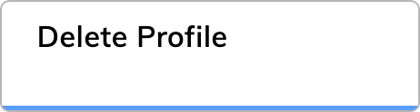

import CollapsibleSection from '@site/src/components/CollapsibleSection';

import ProfileNodeUseCase from '@site/docs/_includes/ai/node-reference/analytics/_profile-node-use-case.md';

# Delete Profile

<figure>
  
</figure>

## Description

This Node is used to delete a [specific Contact Profile](../../../analyze/contact-profiles.md#view-a-contact-profile) if the end user requests it.

:::danger

  Executing this Node will delete the user's entire Profile, including all analytics data and all transcripts. The user's data will no longer be available.

:::

<ProfileNodeUseCase />

## More Information

- [Activate Profile](activate-profile.md)
- [Update Profile](update-profile.md)
- [Deactivate Profile](deactivate-profile.md)
- [Merge Profile](merge-profile.md)