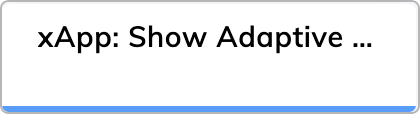

import CustomNode from '@site/docs/_includes/ai/xApp/_custom-node.md';
import WaitingBehavior from '@site/docs/_includes/ai/xApp/_waiting-behavior.md';
import Overlay from '@site/docs/_includes/ai/xApp/_overlay.md';

# Set AdaptiveCard xApp State

<figure>
  
</figure>

## Description

An xApp Page can be built by providing an Adaptive Card in JSON format.

To submit data back to the Flow, you need to include an action of type submit within the Adaptive Card.

To view submitted data, use the Interaction panel. You can access submitted data in the `data` object by clicking **INFO > Input**, or in the chat by adding a Say Node and specifying <code>Submit payload: &lcub;&lcub;JSON.stringify(input.data)&rcub;&rcub;</code> or <code>Submit payload: &lcub;&lcub;JSON.stringify(ci.data)&rcub;&rcub;</code>.

<CustomNode />

## Parameters

??? info "AdaptiveCard Definition"

    The [Adaptive Card Designer](https://adaptivecards.io/designer) can help you to define an Adaptive Card. Copy the JSON card payload and paste it into the form.

??? info "Style Overrides"

    To override the background and interaction element colors, use CSS color codes.

<WaitingBehavior />

<Overlay />

## More Information

- [xApps](../../../../xApps/overview.md)
- [xApp Nodes](overview.md)
- [xApp: Init Session](init-xApp-session.md)
- [xApp: Get Session PIN](get-xApp-session-PIN.md)
- [xApp: Show HTML](set-html-xApp-state.md)