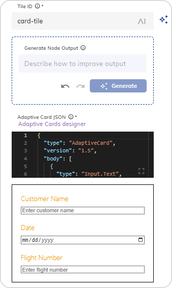

import CollapsibleSection from '@site/src/components/CollapsibleSection';

import AdaptiveCardGenAI from '@site/docs/_includes/ai/nodes/_adaptive-card-genai.md';

# Copilot: Adaptive Card Tile

<a href="../../../../release-notes/4.79.md" />

<figure>
  
</figure>

## Description

This Node allows you to create and display adaptive cards in your AI Copilot workspace. Adaptive cards can display rich content and interactive elements, such as images, text, buttons, and forms. 

The [Adaptive Card Designer](https://adaptivecards.io/designer) can help you to define an Adaptive Card. Copy the JSON card payload and paste it into the form. Alternatively, you can use Generative AI to create a new adaptive card or improve an existing one.

## Parameters 

| Parameter            | Type          | Description                                                                                    |
|----------------------|---------------|------------------------------------------------------------------------------------------------|
| Tile ID              | CognigyScript | The ID that you created in the AI Copilot configuration.                                       |
| Generate Node Output | Text          | A prompt or instruction for generating the Adaptive Card. To apply the prompt, click Generate. |
| Adaptive Card JSON   | HTML          | The Adaptive Card JSON payload to render inside the tile.                                      |
| JSON Data            | JSON          | The Data to send to the IFrame as a postMessage event.                                         |

<CollapsibleSection title="Create an Adaptive Card with Generative AI">

    Before creating an Adaptive Card with Generative AI, ensure that you are connected to one of the [LLM Providers](../../../empower/generative-ai.md#prerequisites).
    
    To use this feature, follow these steps:
    
    <AdaptiveCardGenAI />
    
    <figure>
      
    </figure>
    

</CollapsibleSection>

## More Information

- [Copilot: HTML file](set-html-tile.md)
- [Copilot: IFrame tile](set-iframe-tile.md)
- [Copilot: Set Grid](set-grid.md)
- [AI Copilot Nodes](overview.md)
- [AI Copilot](../../../../ai-copilot/overview.md)