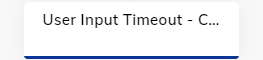

import ACAndGenericNodeDeprecation from '@site/docs/_includes/ai/node-reference/voice/_ac-and-generic-node-deprecation.md';

# User Input Timeout Config

<ACAndGenericNodeDeprecation />

<figure>
  
  <figcaption>Generic User Input Timeout - Config</figcaption>
</figure>

## Description

The User Input Timeout - Config Node defines the action that the AI Agent should take if it does not receive any input from the user within a certain timeframe. 

Once the settings are executed, they will remain in effect for the duration of the session.

| Parameter             | Type     | Description                                                                                                                            |
|-----------------------|----------|----------------------------------------------------------------------------------------------------------------------------------------|
| User No Input Mode    | Dropdown | Define the action if a user does not provide input to the AI Agent in time.                                                            |
| User No Input Timeout | Number   | Define the timeout for user input in  milliseconds.                                                                                    |
| User No Input Retries | Number   | Define the number of retries for the AI Agent to request input from the user before ending the call. The maximum value is 999 retries. |